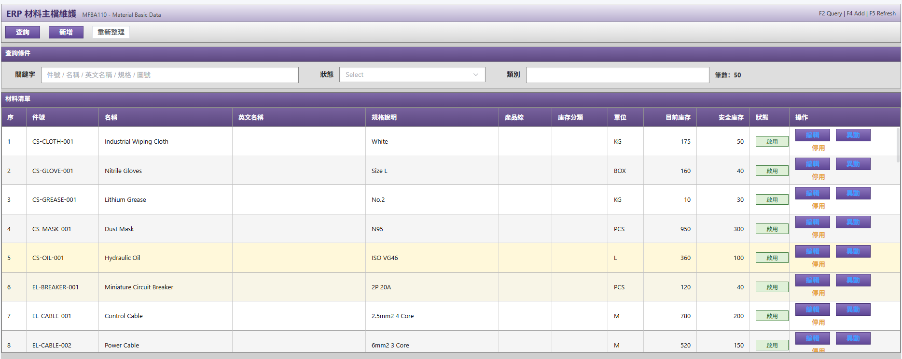
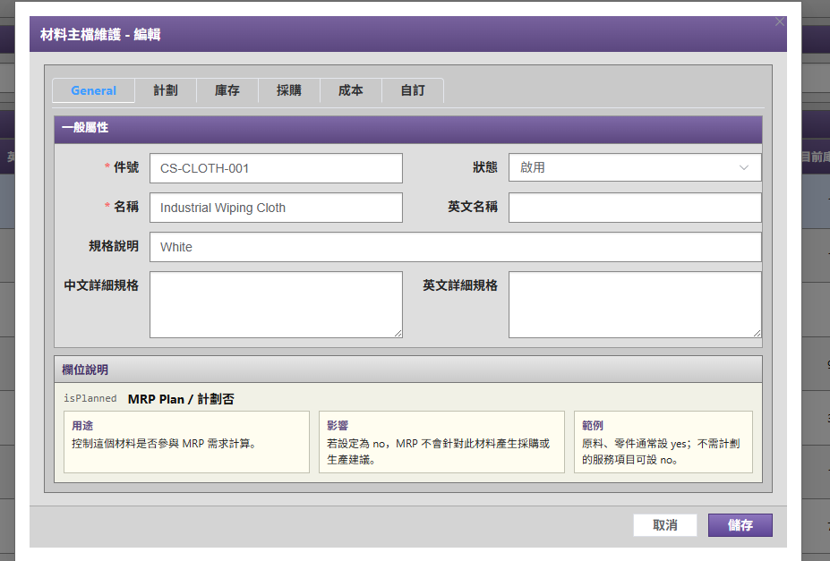
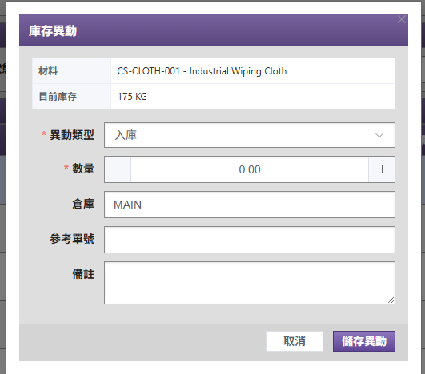

# ERP 物料管理系統

這是一個 ERP 風格的物料管理後台系統，整合 Vue 3 前端、Flask API 與 SQLite 資料庫。系統目前聚焦在登入驗證、物料主檔維護、庫存數量管理與物料異動紀錄。

## 功能特色

- 使用者登入與 Token 驗證
- 物料主檔查詢、新增、編輯與啟用狀態管理
- 物料庫存入庫、出庫與調整
- 物料異動紀錄查詢
- ERP 後台風格的選單、查詢條件與資料表格
- 前後端 API 串接與 SQLite 資料持久化

## 技術架構

### 前端

- Vue 3
- TypeScript
- Vite
- Vue Router
- Pinia
- Element Plus
- Axios

### 後端

- Python
- Flask
- Flask-CORS
- SQLite

## 專案結構

```text
erp-material-management/
├─ backend/                # Flask API 與後端 SQLite 資料庫
│  ├─ app.py
│  ├─ .env.example
│  └─ gateflow.db
├─ src/                    # Vue 前端原始碼
│  ├─ api/
│  ├─ components/
│  ├─ layout/
│  ├─ router/
│  └─ views/
├─ .env                    # 前端本機 API 設定
├─ package.json
└─ vite.config.ts
```

## 環境需求

- Node.js 18 或以上
- npm 或 pnpm
- Python 3.10 或以上

## 快速開始

### 1. 安裝前端套件

```bash
npm install
```

若團隊使用 pnpm，也可以改用：

```bash
pnpm install
```

### 2. 設定前端 API 位址

確認專案根目錄的 `.env`：

```env
VITE_API_BASE=http://127.0.0.1:5000
```

### 3. 設定後端環境變數

複製後端範例設定：

```bash
cd backend
cp .env.example .env
```

Windows PowerShell 可使用：

```powershell
cd backend
Copy-Item .env.example .env
```

接著編輯 `backend/.env`：

```env
DB_NAME=gateflow.db
API_USERNAME=your-api-username
API_PASSWORD=your-api-password
AUTH_SECRET=replace-with-a-long-random-secret
TOKEN_EXPIRES_SECONDS=28800
```

`API_USERNAME` 與 `API_PASSWORD` 用於前端登入驗證。

### 4. 安裝後端套件

```bash
pip install flask flask-cors
```

### 5. 啟動後端

請從 `backend` 目錄啟動，讓 SQLite 資料庫路徑固定在後端目錄下：

```bash
cd backend
python app.py
```

後端預設啟動於：

```text
http://127.0.0.1:5000
```

### 6. 啟動前端

另開一個終端機，回到專案根目錄後執行：

```bash
npm run dev
```

前端預設啟動於：

```text
http://localhost:5173
```

## 常用指令

```bash
# 啟動前端開發伺服器
npm run dev

# 建置前端
npm run build

# 預覽建置結果
npm run preview

# 啟動後端 API
cd backend
python app.py
```

## 主要頁面

- `/login`：登入頁
- `/`：首頁
- `/materials/list`：物料管理
- `/member/list`：會員列表頁面

## 系統畫面

### 物料查詢

物料清單頁面提供關鍵字、狀態與類別查詢，並可直接進入編輯、庫存異動與停用/啟用操作。



### 物料主檔維護

主檔維護畫面以 ERP 分頁方式整理一般資料、計劃、庫存、採購、成本與自訂欄位，方便學習材料主檔在 ERP 中的不同資料面向。



### 庫存異動

庫存異動畫面可針對材料進行入庫、出庫與調整，並記錄倉庫、參考單號與備註。



## API 概覽

| 方法 | 路徑 | 說明 |
| --- | --- | --- |
| `POST` | `/api/auth/login` | 使用者登入 |
| `GET` | `/api/auth/me` | 取得目前登入者資訊 |
| `GET` | `/api/materials` | 查詢物料清單 |
| `POST` | `/api/materials` | 新增物料 |
| `PUT` | `/api/materials/<material_id>` | 更新物料 |
| `PATCH` | `/api/materials/<material_id>/status` | 更新物料啟用狀態 |
| `GET` | `/api/material-transactions` | 查詢物料異動紀錄 |
| `POST` | `/api/material-transactions` | 新增物料異動 |

## 資料欄位文件

- [ERP 物料管理資料欄位文件](docs/material-data-dictionary.md)

## 注意事項

- `backend/.env` 內含登入帳密與簽章密鑰，正式環境請不要提交到版本控制。
- `AUTH_SECRET` 在正式環境應改成長度足夠且不可猜測的隨機字串。
- 後端啟動時會自動建立物料管理需要的 SQLite 資料表。
- `dist/` 是前端建置輸出，開發時主要維護 `src/` 與 `backend/`。
